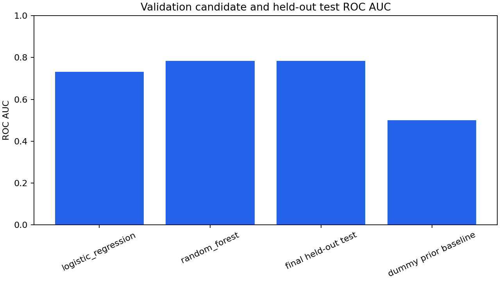
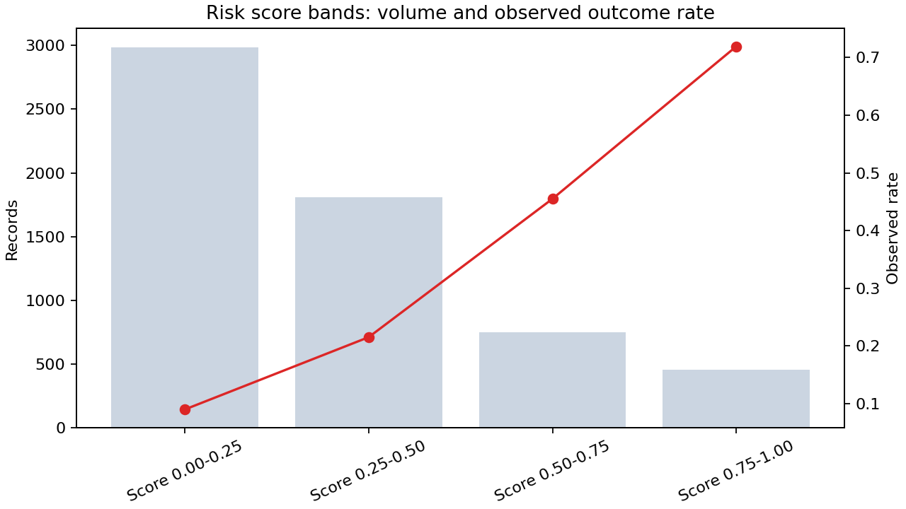

# Credit card default risk analysis

This independent student project evaluates next-month default-risk ranking on the original UCI Default of Credit Card Clients dataset. It is a reproducible model-validation study, not a lending tool. The project asks how a portfolio team can describe observed risk, compare candidate models, and inspect score bands while keeping test evaluation and operational claims separate. The authoritative outputs are under `reports/uci/`; older files in the repository-level `reports/` directory are retained as a historical synthetic demonstration and are not evidence for this UCI study.

Repository: [nkpendyam/credit-card-default-risk-analysis](https://github.com/nkpendyam/credit_risk_analysis)

## Dataset and scope

The source contains 30,000 Taiwan credit-card client records from 2005, including 6,636 positive default labels. Features cover credit limit, repayment status, bill amounts, payment amounts, and legacy profile fields. Sex, age, education, and marital status are retained as source fields; this project does not establish fairness, legal suitability, or permitted use.

Source: [UCI Default of Credit Card Clients](https://archive.ics.uci.edu/dataset/350/default+of+credit+card+clients), DOI `10.24432/C55S3H`, CC BY 4.0. Cite Yeh and Lien (2009), “The comparisons of data mining techniques for the predictive accuracy of probability of default of credit card clients.”

## Verified results

The split is approximately 60% training, 20% validation, and 20% test. Feature-identical records are grouped before splitting: 17,999 training rows, 6,001 validation rows, and 6,000 test rows, with zero feature-group overlap. Preprocessing is fitted on training data. Candidate selection uses validation ROC AUC; the held-out test set is evaluated once for the selected model and a dummy prior baseline.

| Model | Split | Selected | ROC AUC | Average precision | F1 | Precision | Recall |
| --- | --- | --- | ---: | ---: | ---: | ---: | ---: |
| Logistic regression | Validation | No | 0.73213010 | 0.51377467 | 0.49621106 | 0.39552573 | 0.66566265 |
| Random forest | Validation | Yes | 0.78342129 | 0.56910058 | 0.53980892 | 0.57263514 | 0.51054217 |
| Random forest | Held-out test | Yes | 0.78317125 | 0.55722406 | 0.52806324 | 0.55527847 | 0.50339111 |
| Prior baseline | Held-out test | No | 0.50000000 | 0.22116667 | 0.00000000 | 0.00000000 | 0.00000000 |

The complete manifest is `reports/uci/model_metrics_full.json`; the compact table is `reports/uci/model_metrics.csv`. The `pr_auc` field is the saved `average_precision_score` under a legacy column name. The score-band summary is descriptive: it reports customer counts, observed default rates, and average model scores. It does not claim calibrated probability.





## Implementation decisions

- Raw UCI/Kaggle column aliases are standardized into one model schema, and required fields are checked before training.
- Numeric validation rejects missing or nonfinite required features, and target validation rejects missing, fractional, or nonbinary labels rather than silently converting them.
- Feature-identical rows remain in one split to reduce leakage from repeated records.
- Logistic regression provides a linear baseline; random forest provides the selected nonlinear candidate.
- Model selection happens on validation data. The test partition is not used for refitting, threshold tuning, or candidate selection.
- Predictions export model scores and score bands for retrospective inspection. They are not approvals, collections rules, or lending recommendations.

## Reproduce locally

```text
pip install -r requirements.txt
python src/download_data.py --source uci
python src/train_model.py --data-path data/raw/UCI_Credit_Card.csv --reports-dir reports/uci --output-dir models/uci
python src/build_evidence_report.py
pytest -q
```

## Project structure

```text
src/load_data.py                 loading, standardization, and validation
src/preprocess.py                training-only preprocessing
src/train_model.py               grouped split, selection, and evaluation
src/predict.py                   score export and score bands
src/build_evidence_report.py     static PNG and embedded HTML evidence report
tests/                           validation, split, prediction, and training tests
reports/uci/model_metrics.csv    compact verified metrics
reports/uci/model_metrics_full.json  source, split, and evaluation manifest
reports/uci/risk_segment_summary.csv  score-band evidence
reports/uci/analysis.html        self-contained report with embedded charts
```

Twelve local tests cover malformed targets, nonfinite features, deterministic group isolation, training execution, unlabelled CSV/XLSX prediction, standardized Excel headers, and the core pipeline behavior.

## Limitations

The data is observational and historical, not a current lending population. Score bands are not calibrated probabilities. The study does not establish fairness, causal effects, deployment readiness, or financial savings. Default labels, collection practices, missingness, temporal drift, and operating costs require separate review before any operational use.
