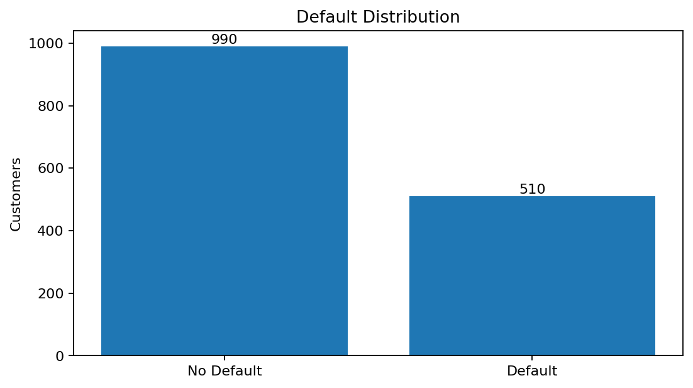
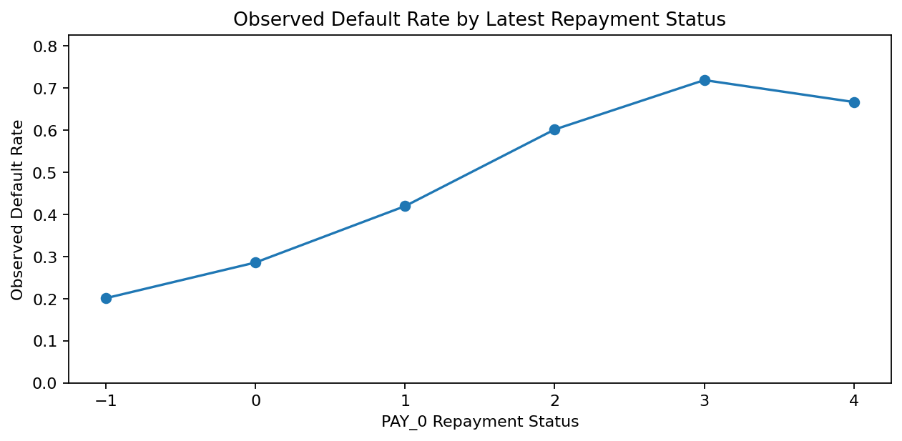
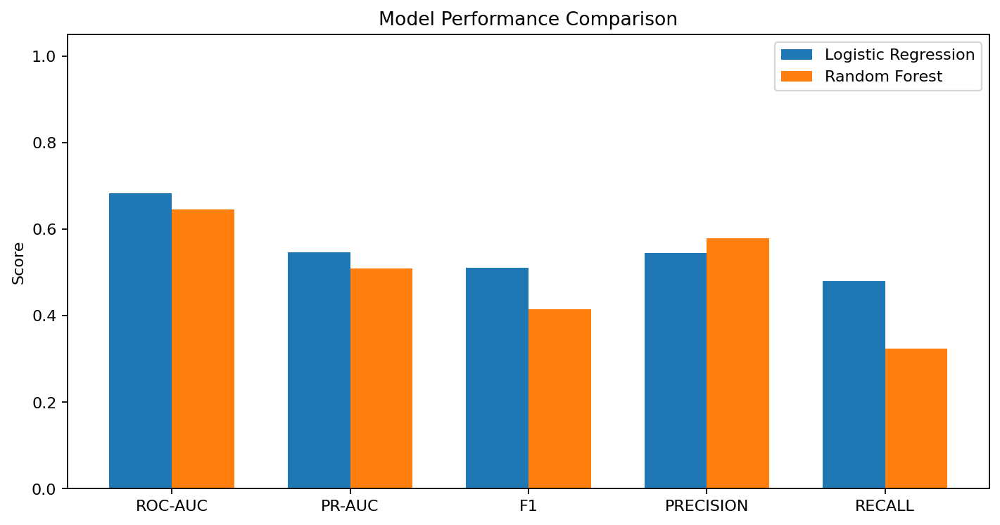
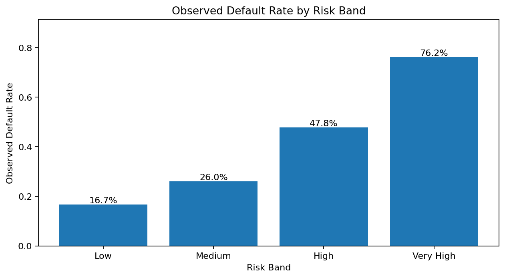
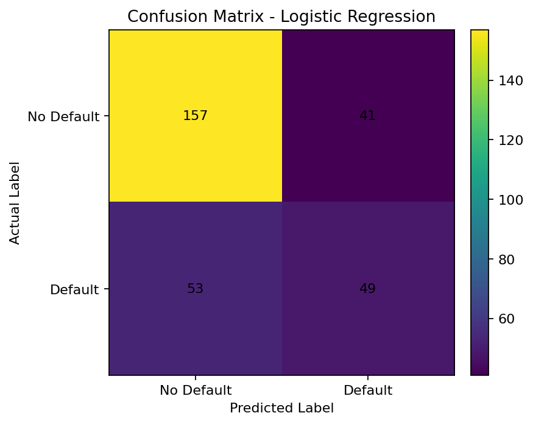

# Credit Card Default Risk Analysis

A professional credit-risk analytics project that predicts whether a credit-card customer is likely to default next month using repayment history, bill amounts, payment amounts, credit limit, and customer profile variables.

This project is designed for **Credit Card Risk Analyst**, **Credit Risk Analyst**, **Risk Analytics**, and **Data Analyst** portfolio use.

> Note: The repository includes a synthetic sample dataset so the project can run immediately. The full public UCI/Kaggle dataset can be downloaded using the provided downloader script.

## Features

- Predicts customer-level credit-card default risk using repayment history, bill/payment amounts, credit limit, and demographics
- End-to-end pipeline: data cleaning, feature engineering, model training, evaluation, and risk segmentation
- Compares Logistic Regression and Random Forest using ROC-AUC, PR-AUC, F1, Precision, and Recall
- Segments customers into Low/Medium/High/Very High risk bands for business reporting
- Ships with a synthetic sample dataset plus a UCI/Kaggle downloader for the full dataset
- Generates report figures, CSV metrics, and risk-segment summaries
- Includes smoke tests and a repository audit script

---

## Business Problem

Credit-card lenders need to identify customers who may default so they can manage portfolio risk, improve collections strategy, and support responsible credit decisioning.

This project answers:

- Which customer attributes are related to default risk?
- Can a machine-learning model predict high-risk customers?
- Can customers be segmented into low, medium, high, and very-high risk bands?
- Can the results be presented in a clear business-reporting format?

---

## Dataset

The project supports the public **Default of Credit Card Clients** dataset from the UCI Machine Learning Repository and its Kaggle mirror.

| Item | Details |
|---|---|
| Full dataset source | UCI Machine Learning Repository |
| Kaggle mirror | `uciml/default-of-credit-card-clients-dataset` |
| Full dataset size | 30,000 customers |
| Target variable | `default_next_month` |
| Problem type | Binary classification |
| Main features | Credit limit, repayment status, bill amount, payment amount, age, education, sex, marital status |

The committed file `data/sample/credit_card_default_sample.csv` is a **synthetic UCI-compatible sample** for quick execution, testing, and README visuals. It should not be presented as real banking customer data.

---

## Project Workflow

```text
Raw Credit Card Data
        ↓
Data Cleaning and Column Standardization
        ↓
Feature Engineering and Preprocessing
        ↓
Model Training: Logistic Regression and Random Forest
        ↓
Model Evaluation: ROC-AUC, PR-AUC, F1, Precision, Recall
        ↓
Risk Segmentation: Low, Medium, High, Very High
        ↓
Business-Style Reports and Visualizations
```

---

## Key Results on Included Sample Data

| Model | ROC-AUC | PR-AUC | F1 | Precision | Recall |
|---|---:|---:|---:|---:|---:|
| Logistic Regression | 0.683 | 0.547 | 0.510 | 0.544 | 0.480 |
| Random Forest | 0.646 | 0.509 | 0.415 | 0.579 | 0.324 |

Best model on the included sample data: **Logistic Regression**.

> These numbers are from the included synthetic sample data and are mainly for demonstrating the workflow. Results will differ when training on the full public dataset.

---

## Visual Analysis

### 1. Target Distribution



### 2. Default Rate by Latest Repayment Status



### 3. Model Performance Comparison



### 4. Observed Default Rate by Risk Band



### 5. Confusion Matrix



---

## Risk Segment Summary

| Risk Band | Customers | Observed Default Rate | Average Predicted Default Probability |
|---|---:|---:|---:|
| Low | 18 | 16.7% | 21.8% |
| Medium | 192 | 26.0% | 37.9% |
| High | 69 | 47.8% | 60.0% |
| Very High | 21 | 76.2% | 82.3% |

This segmentation converts model probabilities into business-friendly groups that can support credit policy review, portfolio monitoring, and collections prioritization.

---

## Repository Structure

```text
credit-card-default-risk-analysis/
├── data/
│   ├── raw/                         # Full downloaded dataset goes here; not committed
│   ├── sample/                      # Synthetic sample dataset committed for quick run
│   └── README.md                    # Dataset notes and source details
├── reports/
│   ├── figures/                     # README charts
│   ├── model_metrics.csv            # Model comparison metrics
│   └── risk_segment_summary.csv     # Risk-band summary report
├── src/
│   ├── config.py                    # Project paths and column definitions
│   ├── download_data.py             # UCI/Kaggle dataset downloader
│   ├── load_data.py                 # Data loading, cleaning, validation
│   ├── make_report_figures.py       # Creates README/report charts
│   ├── make_sample_data.py          # Regenerates synthetic sample data
│   ├── predict.py                   # Scores customers using trained model
│   ├── preprocess.py                # Encoding and scaling pipeline
│   └── train_model.py               # Model training and evaluation
├── tests/
│   └── test_pipeline.py             # Smoke tests
├── audit_repo.py                    # Local repo audit script
├── requirements.txt
├── LICENSE
├── .gitignore
└── README.md
```

---

## How to Run Locally

### 1. Clone the repository

```bash
git clone https://github.com/nkpendyam/credit-card-default-risk-analysis.git
cd credit-card-default-risk-analysis
```

### 2. Create a virtual environment

Windows PowerShell:

```powershell
python -m venv .venv
.\.venv\Scripts\Activate.ps1
```

macOS/Linux:

```bash
python -m venv .venv
source .venv/bin/activate
```

### 3. Install dependencies

```bash
pip install -r requirements.txt
```

### 4. Train using the included sample data

```bash
python src/train_model.py
```

This creates:

```text
models/best_credit_risk_model.joblib
reports/model_metrics.csv
reports/risk_segment_summary.csv
```

### 5. Create prediction output

```bash
python src/predict.py
```

This creates:

```text
reports/predictions.csv
```

### 6. Regenerate README figures

```bash
python src/make_report_figures.py
```

### 7. Run tests and audit

```bash
pytest -q
python audit_repo.py
```

---

## Download the Full Dataset

### Option A: UCI downloader

```bash
python src/download_data.py --source uci
python src/train_model.py --data-path data/raw/UCI_Credit_Card.csv
python src/make_report_figures.py --data-path data/raw/UCI_Credit_Card.csv
```

### Option B: Kaggle downloader

1. Create a Kaggle account.
2. Go to Kaggle account settings and create an API token.
3. Place `kaggle.json` in the required Kaggle API location.
4. Run:

```bash
python src/download_data.py --source kaggle
python src/train_model.py --data-path data/raw/UCI_Credit_Card.csv
python src/make_report_figures.py --data-path data/raw/UCI_Credit_Card.csv
```

---

## Methods Used

- Data cleaning and validation
- Column standardization for UCI/Kaggle formats
- One-hot encoding for categorical fields
- Standard scaling for numeric fields
- Logistic Regression with class balancing
- Random Forest with class-balanced sampling
- ROC-AUC, PR-AUC, F1, Precision, Recall, Confusion Matrix
- Probability-based risk segmentation
- Business-style CSV reporting and graph generation

---

## Skills Demonstrated

- Credit risk analytics
- Credit card default prediction
- Customer risk profiling
- Fraud/default risk awareness
- Python data analysis
- Machine learning classification
- Model evaluation
- MIS-style reporting
- Business communication through visual reports

---

## Limitations and Next Improvements

- The included sample dataset is synthetic and used only for quick demonstration.
- Full model evaluation should be done on the complete UCI/Kaggle dataset.
- Future improvements can include cross-validation, hyperparameter tuning, threshold optimization, feature importance reporting, SHAP analysis, and a Streamlit dashboard.

---

## Disclaimer

This project is for learning and portfolio demonstration only. It is not financial advice and should not be used for real credit decisions without proper validation, governance, compliance review, and fairness testing.

---

## License

MIT — see [LICENSE](LICENSE).
